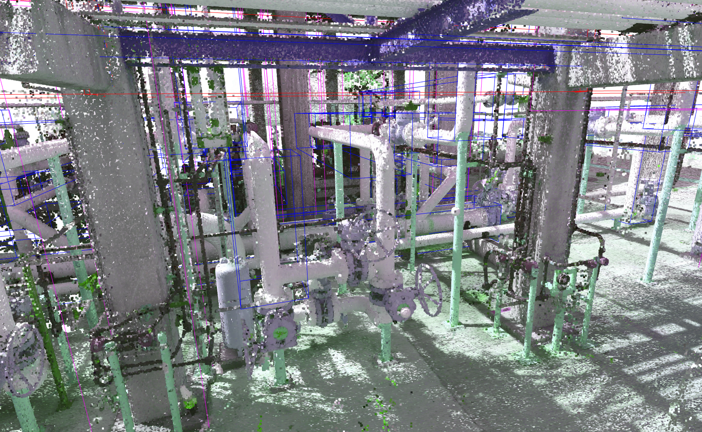
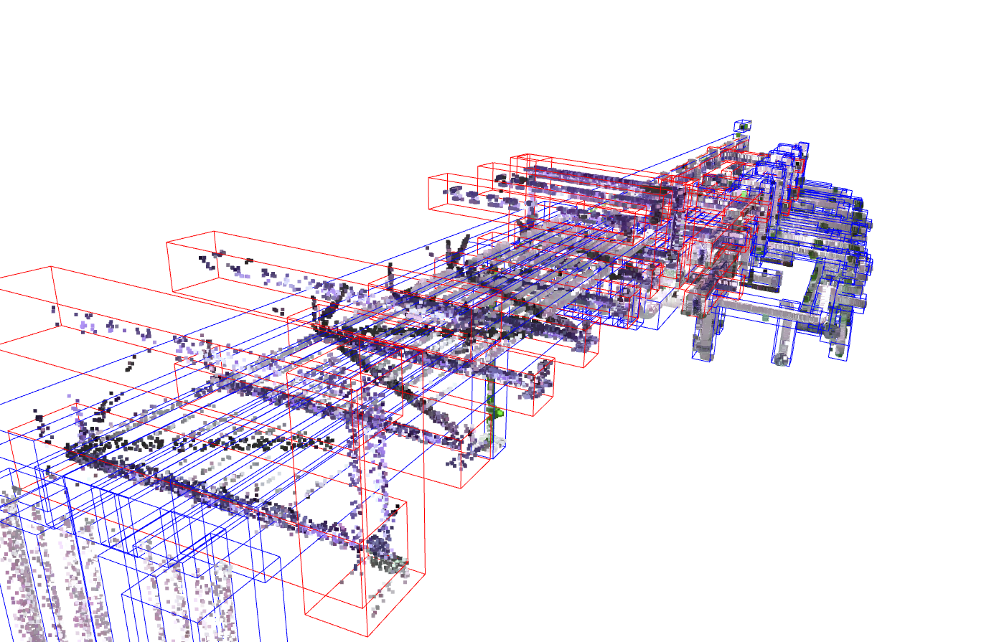
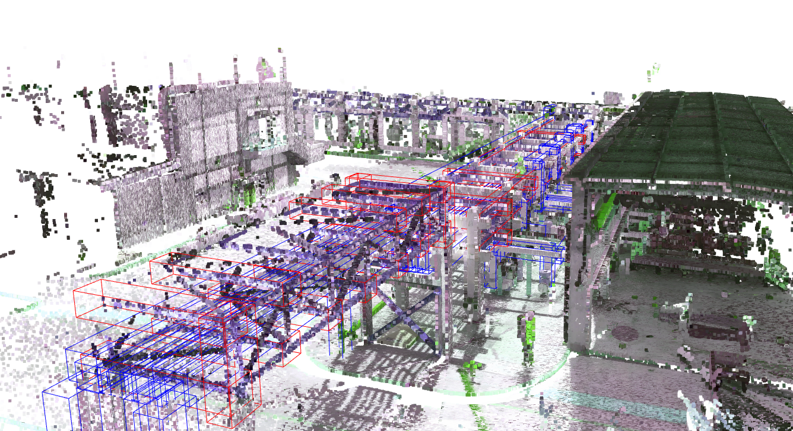
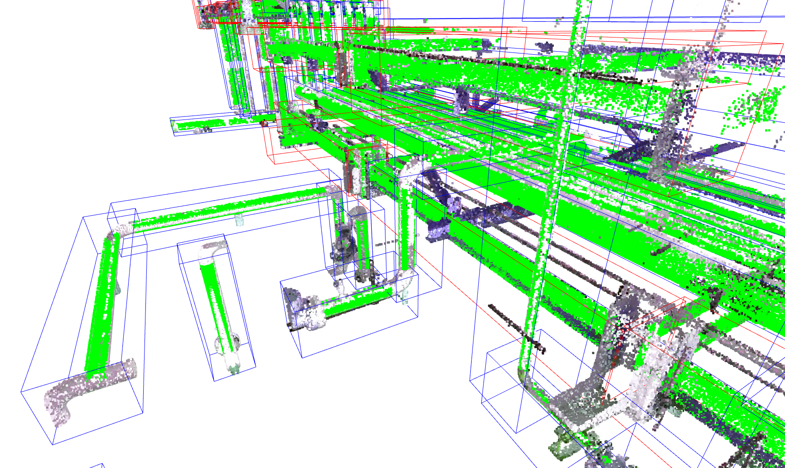
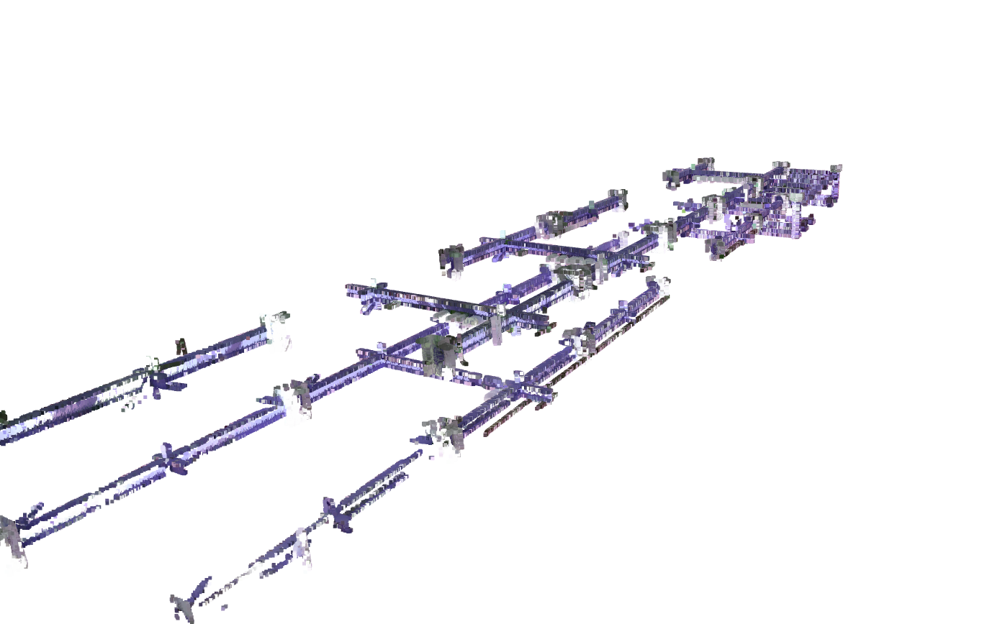
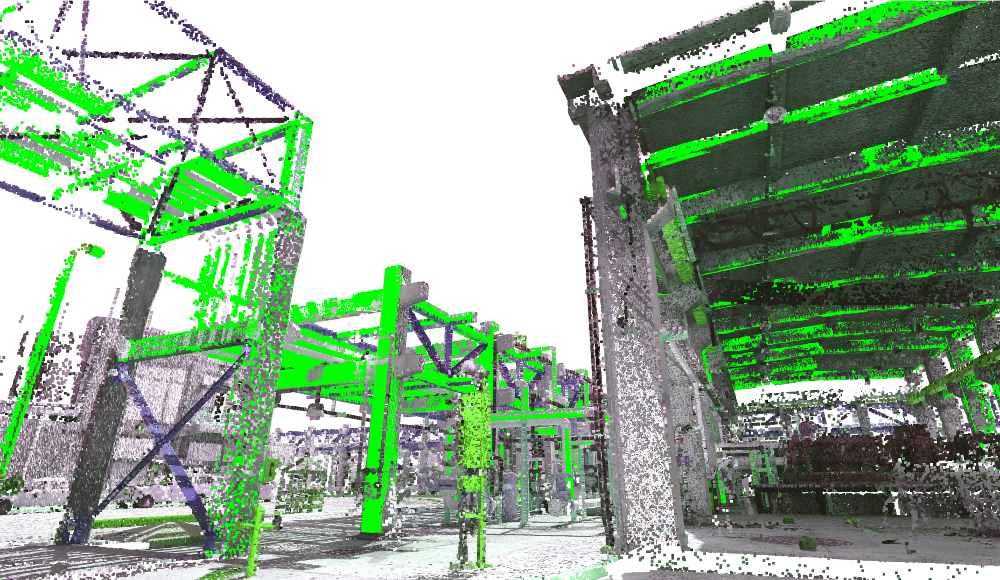
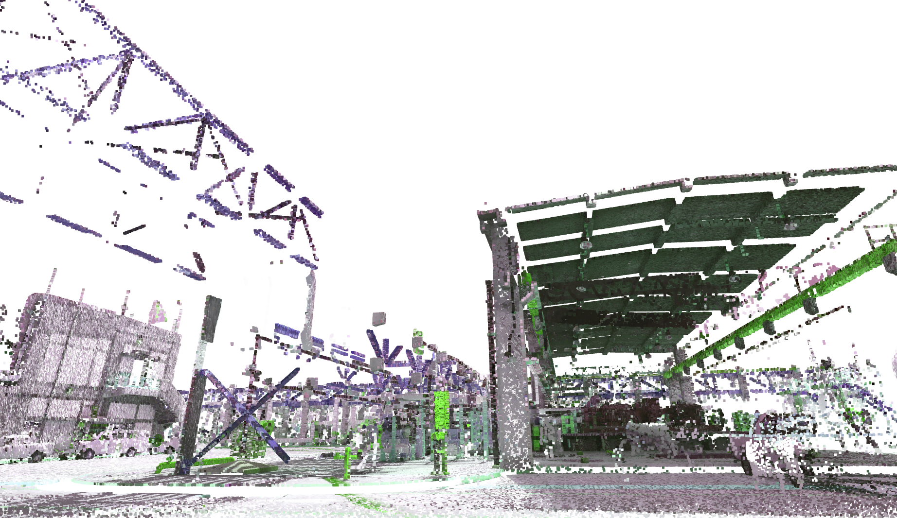

# Quickstart to Open3D

written by: *Andreas Baum, Principal Data Scientist, oaxb@nne.com*

## Table of contents
1. Getting started
2. Dataloader
3. Open3D interactive visualization
   1. Visualize point cloud data interactively
   2. Visualize point cloud data for bounding boxes only
   3. Visualize point cloud data for bounding boxes only and add object masks (green color)
   4. Visualize only subset of project2 containing points inside bounding boxes (without drawing bounding boxes)
   5. Draw entire point cloud with mask
   6. Draw entire point cloud, but remove points belonging to bounding boxes

## Getting started

Download the "TrainingSet" data from the **S3 bucket** or **MS Teams** and store inside the "data" folder of this repo 
for the code to run correctly. You are required to install Open3D using:

````commandline
pip install open3d
````

S3 bucket link: https://innotech3d.s3.eu-north-1.amazonaws.com/ (use AWS CLI, boto3 or s3fs)

## Dataloader

You may use this code to load project data quickly. ```Project2``` contains point cloud data 
as well as metadata for the Project2 facility.

````python
from o3d_tools.visualize import PointCloudProject

# Load Project2
project2 = PointCloudProject(project='Project2')
````

Amongst others, the ```project2``` attributes include:

- ```pcd``` - the point cloud data for Project 2
- ```objects_df``` - a dictionary with keys for all types of objects labeled in Project 2. 
Each key contains a pandas dataframe with object information, such as unique IDs and bounding box specifications
- ```masks``` - a dictionary containing the object masks for all objects labeled in Project 2. Dictionary keys
represent the unique object ID.


## Open3D interactive visualization

### 1. Visualize point cloud data interactively

````python
# Draw point cloud of Project 2
o3d.visualization.draw_geometries([project2.pcd])

# Draw point cloud and add Pipe bounding boxes
o3d.visualization.draw_geometries([project2.pcd] + list(project2.objects['Pipe']))

# Draw point cloud and add bounding boxes for all three object types being available in Project 2
o3d.visualization.draw_geometries([project2.pcd]
                                  + list(project2.objects['Pipe'])
                                  + list(project2.objects['Structural_IBeam'])
                                  + list(project2.objects['Structural_ColumnBeam'])
                                  )
````

The image below shows the result for drawing all three types of bounding boxes. 
A view has been chosen to highlight some pipes being labeled by blue bounding boxes. Structural_IBeams
are labeled using red and Structural ColumnBeans using purple colored bonding boxes.



<br><br>

### 2. Visualize point cloud data for bounding boxes only

````python
# choose which object types to draw/crop from: 
# 'Pipe', 'HVAC_Duct', 'Structural_ColumnBeam' or 'Structural_IBeam'
_ = project2.draw_bb_only(which=['Pipe', 'Structural_IBeam'], plot=True)
````

The left image shows the result of the method call above. The right image is provided for comparison.

<div style="display: flex; justify-content: space-around;">
  
  
</div>

<br><br>

### 3. Visualize point cloud data for bounding boxes only and add object masks (green color)

````python
# choose which object types to draw/crop from: 
# 'Pipe', 'HVAC_Duct', 'Structural_ColumnBeam' or 'Structural_IBeam'
_ = project2.draw_bb_only(which=['Pipe', 'Structural_IBeam'], masked=True, plot=True)
````



<br><br>

### 4. Visualize only subset of project2 containing points inside bounding boxes (without drawing bounding boxes)

````python
# get subset of pcd containing only points as part of Structural IBeam bounding boxes
pcd_sub = project2.draw_bb_only(which="Structural_IBeam", plot=False)
# Draw 
o3d.visualization.draw_geometries(pcd_sub)
````



<br><br>

### 5. Draw entire point cloud with mask

````python
o3d.visualization.draw_geometries([project2.add_mask()])
````




### 6. Draw entire point cloud, but remove points belonging to bounding boxes

This is very slow! Please note that the method can also be used to return the 
"reduced" point cloud ```pcd_without_objects```.

````python
pcd_without_objects = project2.draw_bb_inverse(which_remove=['Pipe', "Structural_IBeam", 
                                                             'Structural_ColumnBeam'])
````

